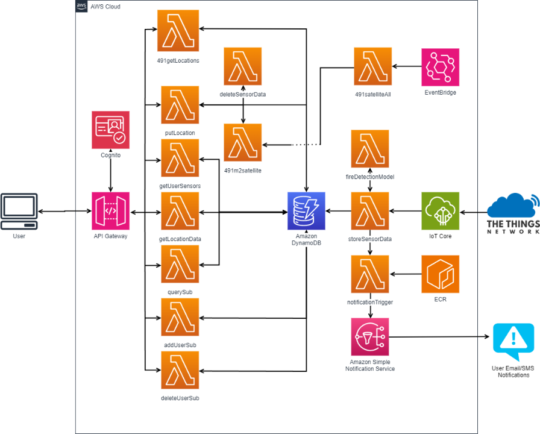

# Remote Sensing Forest Fires

FireWatch is an ECE capstone project dedicated to developing a wildfire prediction and detection system designed to address the threat of wildfires in British Columbia and Canada. This solution involves a deployable prototype that utilizes IoT sensors to collect near real-time data in remote forests and satellite data that monitor wildfires. These data will be displayed on the web application to users and send notifications of high risk areas.

| Index                                               | Description                                             |
| :-------------------------------------------------- | :------------------------------------------------------ |
| [High Level Architecture](#High-Level-Architecture) | High level overview illustrating component interactions |
| [Deployment](#Deployment-Guide)                     | How to deploy the project                               |
| [User Guide](#User-Guide)                           | The working solution                                    |
| [Files/Directories](#Files-And-Directories)         | Important files/directories in the project              |
| [Changelog](#Changelog)                             | Any changes post publish                                |
| [Credits](#Credits)                                 | Meet the team behind the solution                       |
| [License](#License)                                 | License details                                         |

# High Level Architecture

The following architecture diagram displays the AWS backend components and how they are connected. 



# Deployment Guide

To deploy this solution, please follow the steps laid out in the [Deployment Guide](<docs/DeploymentGuide.md>)

# User Guide

For instructions on how to navigate the web app interface, refer to the [User Guide](<docs/UserGuide.md>).

# Files And Directories

```text
.
├── README.md
├── amplify
│   ├── backend
│   │   └── resources
├── backend_cdk
│   └── fireDetectionModel
├── package-lock.json
├── package.json
├── public
├── src
│   ├── AddDevice.js
│   ├── AddSubscription.js
│   ├── App.css
│   ├── App.js
│   ├── App.test.js
│   ├── DataDashboard.js
│   ├── DataView.js
│   ├── FWIVis.js
│   ├── GeneralVis.js
│   ├── Header.js
│   ├── Login.css
│   ├── Login.js
│   ├── Map.js
│   ├── SimpleDialog.js
│   ├── UserDevices.js
│   ├── cancelSub.js
│   ├── icons
│   │   ├── firewatch2.png
│   │   └── green-marker.png
│   ├── index.css
│   ├── index.js
│   ├── logo.svg
│   ├── proto
│   │   └── message.proto
│   ├── reportWebVitals.js
│   ├── setupTests.js
│   └── theme.js
└── yarn.lock
```

# Changelog
N/A

# Credits

This application was architected and developed by Mark Lee, Austin Li, Ethan McKeen, Gurjot Sandhu, and Christy Zhang with guidance from the UBC CIC technical and project management teams.

# License

This project is distributed under the [MIT License](LICENSE).