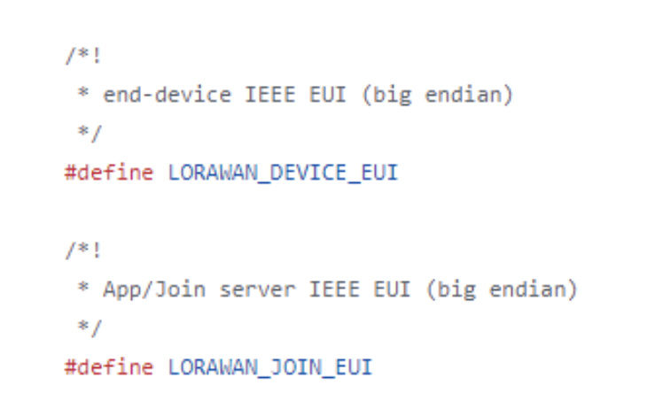
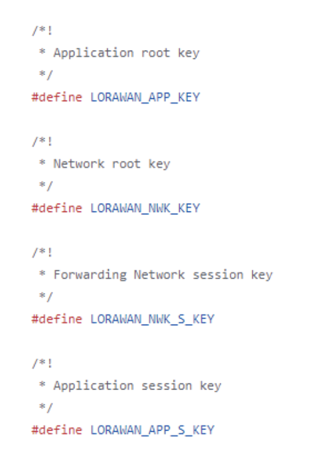

# Remote Sensing for Forest Fires Deployment Guide

## Executive Summary
This document outlines the hardware and software deployment procedures for the forest fire sensor system. The hardware segment details the setup protocol for The Things Network along with instructions for deploying the sensor device. The software section explains the steps for establishing an AWS account and integrating sensors into the network.

## 1. The Things Network Setup Guide
### 1.1 Get DevEUI
Get the 16 HEX digit DevEUI by scanning the QR code on the microcontroller by using the camera of your mobile device. Write this number down.


### 1.2 Set JoinEUI
You may choose the 16 HEX digit JoinEUI value (for our application we used “526973696E674846”). Write this value down.

### 1.3 Create TTN account
Go to www.thethingsnetwork.org and create a new account.

### 1.4 Create Application
#### 1.4.1 After logging in, click on your profile and select the console.


#### 1.4.2 Click on the region that you want to add your device.


#### 1.4.3 Click “Go to applications” then “+ add application.”
#### 1.4.4 Fill in a name and ID for your application and click “Create application.”

### 1.5 Register End Device
#### 1.5.1 Click “+ Register end device.”
#### 1.5.2 Select “Enter end device specifics manually.”
#### 1.5.3 Select the frequency plan associated with your LoRaWAN gateway (for our application this was EU 863-870 MHz).
#### 1.5.4 Select the “LoRaWAN version” and “Regional Parameters version” as shown in the image below.


#### 1.5.5 Set the JoinEUI as chosen earlier in step 1.2. and the DevEUI as written in step 1.1.
#### 1.5.6 Click the “Generate” button for the AppKey and write this value down.
#### 1.5.7 Give the device an ID if desired click “Register end device” to finish the process.


#### 1.5.8 Once Created click on this device and write down the “Device address.”

### 1.6 Edit Firmware
#### 1.6.1 In the project’s github repository, navigate to the directory “Firmware/FreeRTOS_LoRaWAN_AT” file.
#### 1.6.2 Download Seeed-Studio’s github repository found here and go to the directory “LoRaWan-E5-Node-main\Projects\Applications\FreeRTOS.” Replace the “FreeRTOS_LoRaWAN_AT” file here with the one provided in the team’s github repo.
#### 1.6.3 Go to “FreeRTOS_LoRaWAN_AT/LoRaWAN/App” and open the “se-identity.h” file.
#### 1.6.4 Locate the “LORAWAN_DEVICE_EUI” and “LORAWAN_JOIN_EUI” fields. Update these with the DevEUI and JoinEUI as previously written in steps 1.1. and 1.2.



#### 1.6.5 Similarly, locate the “LORAWAN_APP_KEY,” “LORAWAN_NWK_KEY,” “LORAWAN_NWK_S_KEY,” and “LORAWAN_APP_S_KEY” fields and update these values with the AppKey generated and written down in step 1.5.7.



#### 1.6.6 Locate the “LORAWAN_DEVICE_ADDRESS” field and update it with the value written down in step 1.5.8.
#### 1.6.7 In the same directory open the “lora_app.h” file.
#### 1.6.8 Check that the “ACTIVE_REGION” field is the same as the gateway and the region used when creating the application.


#### 1.6.9 Save the changes to the “se-identity.h” and “lora_app.h” files.

## 2. AWS Setup Guide
### 2.1 Prerequisites
Make sure to install the following items on your local machine before proceeding to the next steps for AWS setup:
- Git
- Node.js
- npm
- Docker
- AWS CLI
- Amplify CLI
- AWS CDK CLI

### 2.2 SSO Login From CLI
#### 2.2.1 Follow the steps found here. The following configuration is the configuration actually used for the project.

```ini
sso_start_url = https://ubc-cicsso.awsapps.com/start
sso_region = ca-central-1
sso_registration_scopes = sso:account:access
```

#### 2.2.2 Once sso is set up, you can login again using the following command where <profile-name> is replaced with the chosen profile name.

```
aws sso login -profile <profile-name>
```

#### 2.2.3 In ~/.aws/config add the following line under the [profile <profile-name>] section.

```
credential_process = aws configure export-credentials --profile <profile-name>
```

### 2.3 Deploying Amplify
#### 2.3.1 Initialise Amplify using the following command and follow the steps.

```
amplify init --app https://github.com/UBC-CIC/Forest-Fire-Sensing
```

#### 2.3.2 Deploy the Amplify resources using the following command. This will deploy Lambda functions, DynamoDB tables, Cognito, and API Gateway.

```
amplify push
```

### 2.4 Deploying CDK
#### 2.4.1 Switch to the cdk folder within the repository.
#### 2.4.2 Bootstrap cdk using the following command.

```
cdk bootstrap -region ca-central-1 -profile <profile-name>
```

#### 2.4.3 Once bootstrapped deploy the Lambda function that contains the pre-trained machine learning model using the following command.

```
cdk deploy
```

## 3. Connecting TTN and AWS Guide
### 3.1 Initial Setup
#### 3.1.1 Please refer to the deployment guide provided by The Things Network here.
#### 3.1.2 When generating the API key, provide it all rights as the rights provided in the deployment guide may cause issues with deployment on AWS. Also, choose the sandbox CloudFormation template for deployment.

### 3.2 Connect to Amplify Deployment
#### 3.2.1 Navigate to the AWS web console and to the IoT Core service.
#### 3.2.2 Navigate to the rules as shown below.


#### 3.2.3 Create a new rule which will send all sensor data to a Lambda function that is deployed in Amplify. When creating the rule you’ll be led through the following steps.

##### 3.2.3.1 Choose a name for the rule (can be anything).
##### 3.2.3.2 Provide the following SQL statement.
```
SELECT * FROM 'lorawan/#
```
##### 3.2.3.3 Under rule actions, choose Lambda and then choose the storeSensorData function. 

## 4. Sensor Device Deployment Guide


### 4.1 Setup Gateway
#### 4.1.1 Plug in the gateway power supply (12V - 2A) and connect the antenna (RP - SMA Female).

### 4.2 Connect Gateway to Internet via Luci
#### 4.2.1 Hold down the reset button (labelled “button” in the image above) on the side of the gateway until the indicator light starts flashing blue. This turns on the device AP hotspot.
#### 4.2.2 Using another device that can connect to wifi, like a laptop, refresh the available wifi networks until the AP hotspot appears. The AP hotspot name is “SenseCAP_XXXXXX” (where the “X’s” represent the 6 figure MAC address).


#### 4.2.3 Login to the AP hotspot. The default password is “12345678.”
#### 4.2.4 Using the device that is now connected to the AP hotspot, input the IP Address found on the bottom of the gateway (192.168.168.1) into your browser to open the Luci console.
#### 4.2.5 Login to the Luci console with the username and password found on the bottom of the gateway.


#### 4.2.6 In the console click on Network then wireless. Click scan to find your wifi network and join the network. Input the password into the “WPA passphrase.”


#### 4.2.7 The connection of the gateway is successful if the gateway indicator light starts to glow solid green. It can also be checked on the TTN console by clicking on “Gateways” then checking that status says “Connected.”


### 4.3 Programming the PCB
#### 4.3.1 Download the STM32CubeIDE and the LoRaWan-E5-Node project provided by the CG-23 group.
#### 4.3.2 In the project’s firmware code, navigate to the directory “LoRaWan-E5-Node-main\Projects\Applications\FreeRTOS\FreeRTOS_LoRaWAN_AT” and open the “.project” file.
#### 4.3.3 Plug in the PCB with the micro-usb connection. Connect the ST-Link to the PCB with the JTAG connector and plug in the ST-Link using its mini-usb connection.
#### 4.3.4 Program the PCB by pressing the run button.


#### 4.3.5 Using a serial monitor (such as Putty or Arduino IDE) set for a 115200 baud rate, the connection between the PCB’s LoRa radio, the gateway, and The Things Network is successful if the following message is shown. Note that the PCB has to be reprogrammed because it needs the updated “se-identity.h” file which was updated earlier in section 1.6.


### 4.4 Assemble Enclosure
#### 4.4.1 Place the PCB into the enclosure on the standoffs and screw it into place. Connect the antenna cable on the enclosure lid to the PCB and screw the lid into place. If you wish to screw the enclosure into a tree or wall this must be done before the lid is attached as the lid blocks the access to these screws.

### 4.5 Deploy Device
#### 4.5.1 Leave the enclosure, with the PCB screwed inside, in a location where you want to detect forest fires. This location can be up to 10km away from the gateway if the area is heavily forested. This location can be up to 3km if it is an urban environment. The sensors are rated to sense a 2 x 2m fire up to 100m away.