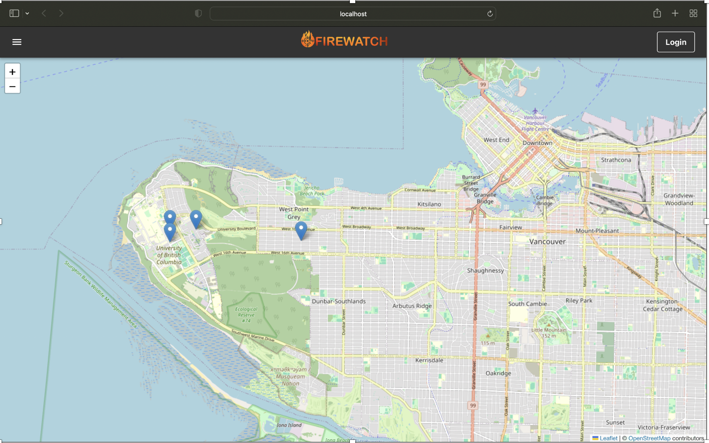
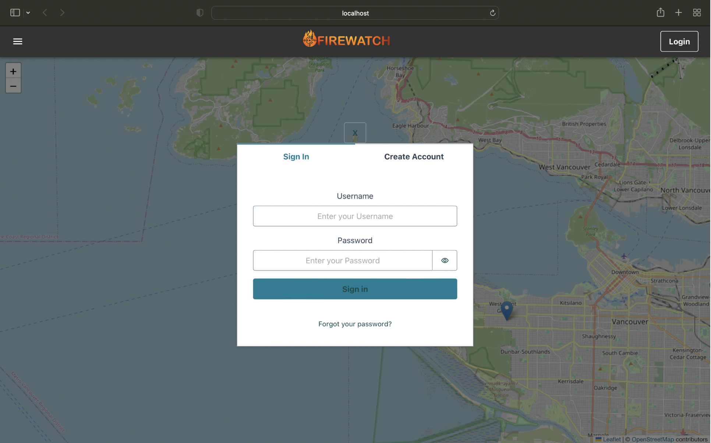
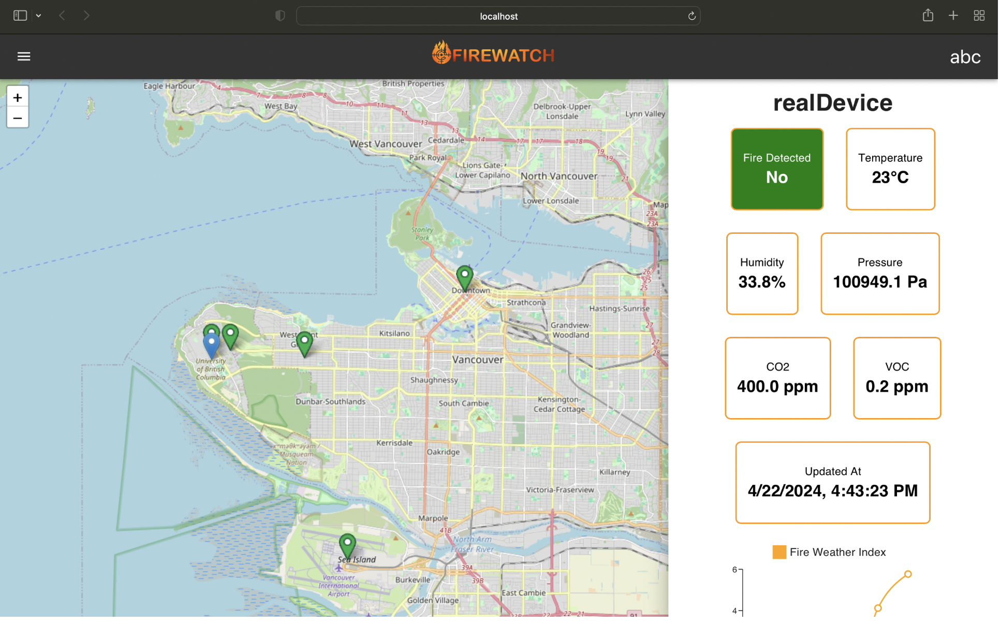
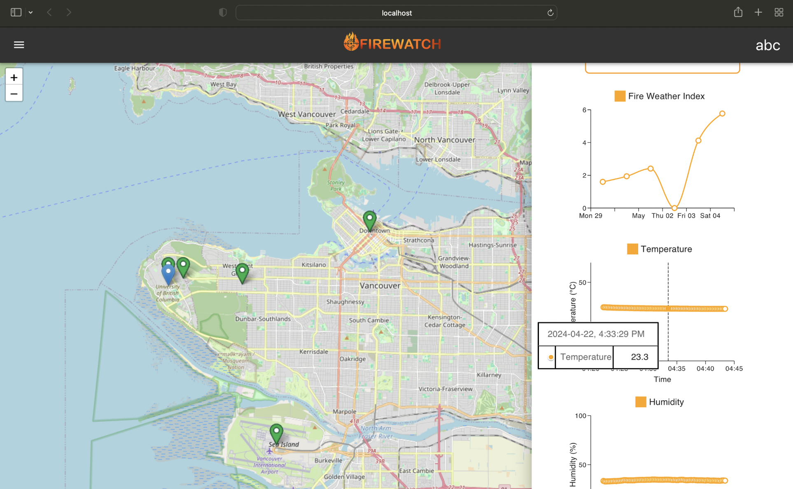
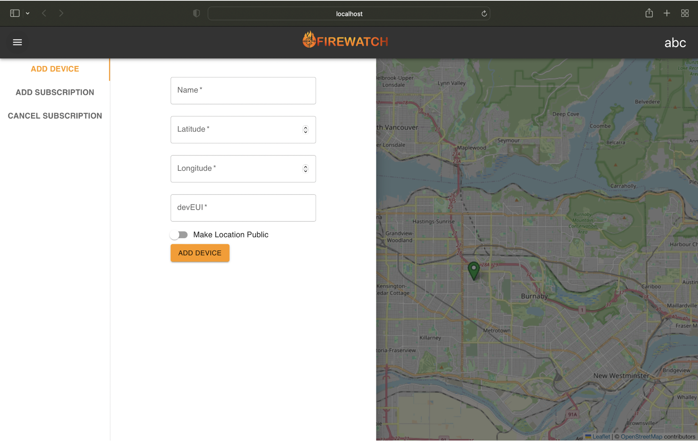
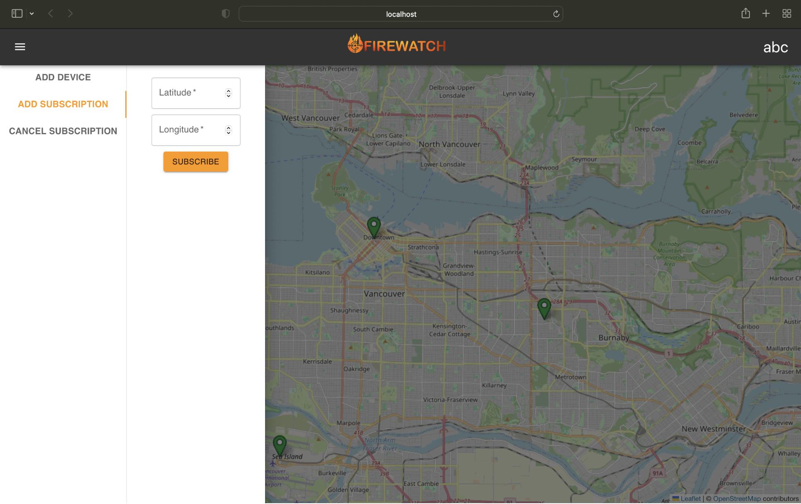
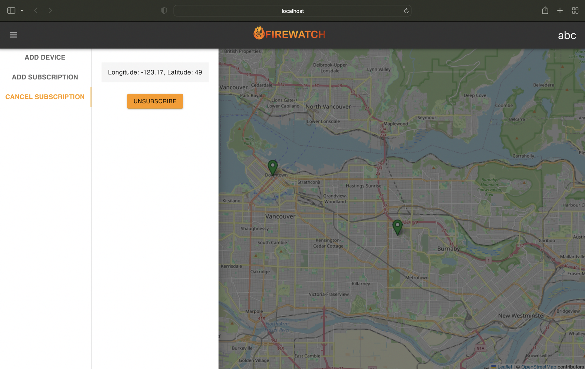

# Remote Sensing for Forest Fires User Guide

## Interacting with the Web App

This section provides detailed instructions on how to navigate and utilize our web application.

1. **Main Page Access**  
   Upon accessing the main page, the website will automatically refresh and display the locations of public sensors.

    

2. **Login**  
   By selecting the Login button located in the top-right corner, a login dialog will appear, prompting users to enter their username and password to access their account.

   

3. **Viewing Sensors**  
   After logging in, users will be able to view both public sensors and those privately owned by them on the map.

   

4. **Sensor Information**  
   Clicking on a sensor marker will open a side panel that presents satellite data for the chosen location, as well as detailed information collected by the sensor.

    
    

5. **Adding Sensors and Subscriptions**  
   The top-left button, when clicked, reveals a side menu that enables users to add a sensor device, subscribe to updates for a specific location using coordinates, and cancel existing subscriptions. Confirmation of these actions will be provided through a pop-up notification indicating their success or failure.

   
   
   

## Maintaining the Sensor Device

### Sensor Device Operation

The sensor device operates using a real-time operating system and its functionality is implemented using tasks. Once powered, the sensor device will immediately attempt to join The Things Network application set up in the deployment guide. If joining fails, the device can be restarted to attempt another join. Once successfully joined, the device will begin making readings every 15 minutes and sending them to The Things Network. This functionality operates using a monitoring task. Another main task of the device is to recognize AT commands. While using a serial monitor to communicate with the device, the LoRa-E5 microcontroller can communicate information using AT commands outlined here. It should be noted that while the command functionality remains the same, the commands themselves differ between our implementation and the original LoRa-E5 firmware. For the list of commands compatible with the sensor device the command “AT?” can be typed into the serial monitor.

### Battery Life

To maintain a sensor device for detecting remote forest fires, ensure to charge it approximately every 1.2 years to guarantee uninterrupted operation. The device can be charged by removing the PCB from its enclosure and plugging in the micro-USB connector.

### Calibrate Sensors

Before deploying the device, run the BME688 sensor for 48 hours to allow it to settle and calibrate its sensors accurately. This can be done by taking readings from the device for 48 hours. During the initial 10 minutes of operation, expect the VOC and CO2 readings to show as 0.5 and 500 respectively; these values will stabilize and reflect actual environmental conditions after this initial period. Regularly check the device readings using the web app for any signs of malfunction to ensure reliable and accurate detection of forest fires.
